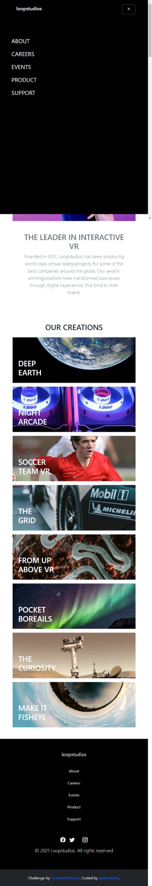

# Frontend Mentor - Loopstudios landing page solution | coded by ajayitoheeb

<!-- This is a solution to the [Loopstudios landing page challenge on Frontend Mentor](https://www.frontendmentor.io/challenges/loopstudios-landing-page-N88J5Onjw). Frontend Mentor challenges help you improve your coding skills by building realistic projects.  -->

## Table of contents

- [Overview](#overview)
  - [The challenge](#the-challenge)
  - [Screenshot](#screenshot)
  - [Links](#links)
- [My process](#my-process)
  - [Built with](#built-with)
  - [What I learned](#what-i-learned)
  - [Continued development](#continued-development)
  - [Useful resources](#useful-resources)
- [Author](#author)
- [Acknowledgments](#acknowledgments)

## Overview

### The challenge

Users will be able to:

- View the optimal layout for the site depending on their device's screen size
- See hover states for all interactive elements on the page

### Screenshot

### Links

- Solution URL: [Add solution URL here](https://your-solution-url.com)
- Live Site URL: [Add live site URL here](https://your-live-site-url.com)

## My process

### Built with

- Semantic HTML5 markup
- CSS custom properties
- Flexbox
- CSS Grid
- Mobile-first workflow
- Bootstrap 5
- JavaScript

### What I learned

Working on this project I learnt a lot about Bootstrap and Bootstrap icon and it's great working with them 

### Continued development

Working on this project showed me how great Bootstrap is and how great css library is, I'll like to continue working with Bootstrap libray and continue boosting my knowledge on JavaScript

### Useful resources

- [Bootstrap Framework](https://www.example.com) - This helped me for XYZ reason. I really liked this pattern and will use it going forward.

- [Bootstrap Icon](https://www.example.com) - This is an amazing article which helped me finally understand XYZ. I'd recommend it to anyone still learning this concept.

## Author

- Website - [ajayitoheeb](https://fearless09.github.io/My-portfolio/)
- Frontend Mentor - [@ajayitoheeb](https://www.frontendmentor.io/profile/Fearless09)
- LinkedLn - [@toheeb-opeyemi](https://www.linkedin.com/in/toheeb-opeyemi-83a6b7195/)
- GitHub - [@ajayitoheeb](https://github.com/Fearless09)